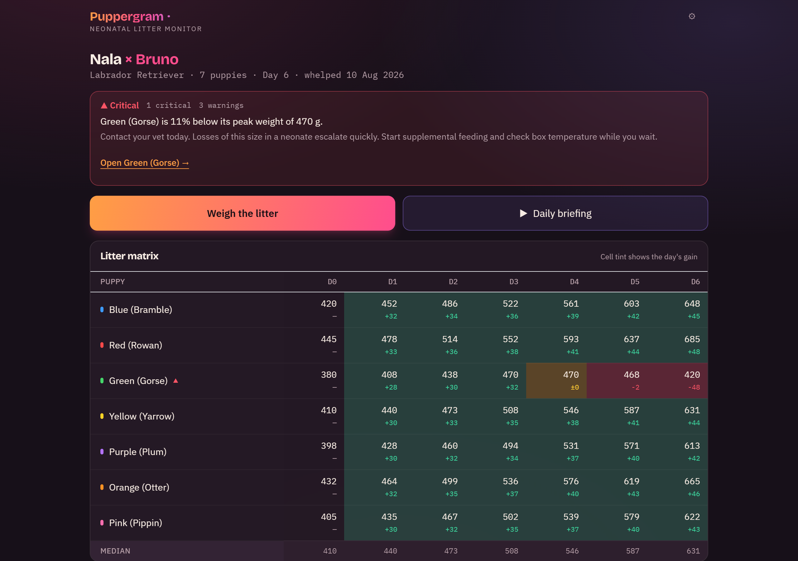

# Puppergram

**Gram by gram, day by day.** A neonatal litter monitor for dog breeders — birth to eight weeks.

> Puppergram watches every puppy's daily weight gain and tells you which one needs attention *tonight*, before there is anything to see.



**Live:** https://puppergram.pages.dev · **Verify a passport:** https://puppergram.pages.dev/verify

---

## The problem

Neonatal mortality in dogs runs at roughly 10–30% in the first three weeks, and weight is the single most predictive vital sign — a puppy that fails to gain for 24 hours, or slips below its birth weight, is in serious trouble long before anything is visible. Most hobby breeders record weights in a paper notebook, where a stalling trend is invisible until it is a crisis. Puppergram is not a weight log with a calendar attached; it is an early-warning system, and the triage engine is the product.

---

## How alerts work

Every rule is hard-coded, transparent, and applied only to weights you entered. Nothing is inferred, predicted, or modelled.

Normal expectation: **5–10% gain per day**, roughly **double birth weight by day 7–10**.

| Rule | Condition | Severity |
| --- | --- | --- |
| Failure to gain | No weight increase in 24h | Warning |
| Weight loss | Any drop vs. previous entry | Warning |
| Below birth weight | Current < birth weight after 48h | **Critical** |
| Significant loss | More than 10% below peak weight | **Critical** |
| Slow doubling | Under 1.8× birth weight by day 10 | Warning |
| Litter divergence | More than 25% below litter median on day N | Warning |
| Missing entry | No weight logged in 36h | Info |

Severity ordering is `critical > warning > info`. A puppy shows only its highest severity; the litter banner shows a count per severity and links straight to the worst-affected puppy. Every alert carries a plain-language action line, never just a label:

> **Green (Gorse) is 11% below its peak weight of 470 g.**
> Contact your vet today. Losses of this size in a neonate escalate quickly. Start supplemental feeding and check box temperature while you wait.

Two deliberate pieces of restraint, both of which exist to stop false alarms at 3am:

- **Below birth weight has a 48-hour grace window.** Healthy neonates normally dip for the first day or two. Firing on that would train the user to ignore the app.
- **Litter divergence needs at least three weighed puppies.** A median of two is just an average, and "below average" is not a finding.

The rule table is rendered inside the app too, under *How alerts work*, so the user never has to take an alert on trust.

### Tested, because a false critical destroys trust

The engine is a pure function — `litter + puppies + weights + care → complete view` — with `now` injected as a parameter so every time-window rule is deterministic.

```
 Test Files  4 passed (4)
      Tests  91 passed (91)
```

That includes a boundary test on each threshold in both directions (10% below peak does *not* fire; 10.1% does), a test that a normally-growing litter produces **zero** alerts, and a set of tests pinning the demo litter's exact alert profile so the headline scenario can't silently drift.

```bash
npm test
```

---

## Derived-state architecture

Nothing computed is ever written to the database. There is no refresh button and no recalculate step, because there is nothing to keep in sync. The only stored data is what the user typed: litter details, puppy details, weights, and care events.

**Birth weight is not a stored field.** It is the earliest weight entry for that puppy. Storing it separately guarantees the two eventually disagree.

```ts
const weights = await db.weights.where('puppyId').anyOf(ids).sortBy('at');
return buildLitterView(litter, puppies, weights, care);
```

Everything else — day columns, per-puppy series, daily gains, litter medians, alerts, milestone state, feeding volumes, temperature targets — is derived on read. The consequence is that logging one weight by voice instantly updates the matrix, the chart, the alert banner, the timeline and the care cards, with no wiring between them.

---

## Recording weights, including days you missed

The weigh flow moves through the litter in collar order, one puppy per screen, never more than one tap apart. It is dark by default, the number pad targets are 48px minimum, and the header tints to the current puppy's collar so you know who you are holding without reading anything.

**Backlogging is a first-class case, not an edge case.** The realistic situation is not "I will type each weight as I take it" — it is "I weighed them every day in a notebook and only got round to entering day 0 and day 9." A **Recording for** control sits above the keypad:

- Defaults to **now**.
- Day chips show, at a glance, which days are complete (`✓`), partly done (a count), or empty (`·`) — so the gaps are visible rather than remembered.
- Or pick an exact date and time, clamped so an entry can never land before the whelp or in the future.

Backlogged entries are stored identically to live ones and feed the same rules, so filling in a gap immediately recomputes that day's column, the daily gains either side of it, and the litter median. Two deliberate differences while backlogging:

- The reference weight shown is **the last reading from a day before the target day** — never the target day's own existing reading, which would make the expected range describe the wrong day.
- The spoken confirmation does **not** escalate. Triage describes a puppy's state *now*; announcing "call your vet" while filling in last Tuesday's paperwork would be wrong.

## Voice, via ElevenLabs

**Voice is not a bolt-on here; it is the correct input method.** The user is holding a wet puppy in one hand and a kitchen scale in the other, at 3am, in a dim outbuilding. Typing is the worst available interface. Speaking *"blue, two forty five"* is the best one.


### Parsing real speech

Breeders do not speak like a form. The parser accepts digits, spoken compounds, and digit-by-digit readings, all of which appear in practice:

| Spoken | Parsed |
| --- | --- |
| `blue two forty five` | 245 g |
| `blue two hundred and forty five` | 245 g |
| `blue two four five` | 245 g |
| `blue 245g` | 245 g |
| `blue one ten` | 110 g |
| `blue eleven hundred` | 1100 g |

The interesting case is the **elided hundred**: *"two forty five"* means 245, so a single digit followed by a tens word is read as hundreds-plus-tens. It also tolerates filler (*"okay blue is two forty five"*), the number before the colour (*"245 blue"*), homophones the recogniser produces (`gray`/`grey`, `for`/`four`, `to`/`two`), and rejects anything outside a plausible 50–20000 g range rather than recording it.

**A parse is never committed automatically.** It renders as a confirmation chip with one-tap Save, Correct, and Discard. Voice that cannot be corrected is worse than typing.

### Three-layer backend resolution — no key entry field anywhere

1. **ElevenLabs**, through a Cloudflare Pages Function using a server-side key. Anyone opening the live URL gets this with zero configuration.
2. **Web Speech API**, whenever the proxy is absent, out of quota, or failing. A silent downgrade, never an error.
3. **The manual keypad**, always on screen regardless.

Any non-200 from the proxy means *downgrade and continue* — `402` and `429` included. The active backend is shown as a small label in settings (`Voice: ElevenLabs` / `Voice: browser`).

The key never reaches the client. `/api/health` returns only a boolean:

```ts
return new Response(JSON.stringify({ elevenlabs: Boolean(env.ELEVENLABS_API_KEY) }), …);
```

`/api/tts` and `/api/stt` proxy server-side with an origin check, a per-IP daily counter, and a global daily cap. Upstream error bodies are never echoed to the client, because they can carry account detail. STT uses `scribe_v2` — note the widely-copied `scribe_v1` is now **deprecated**.

### Output

TTS reads back after every entry, escalating on a triage hit, in a calm low-urgency voice because this plays at 3am:

- `"Blue, 245 grams, up 18. Good."`
- `"Red has lost weight since the last weigh-in. Check warmth and nursing."`
- `"Green, 420 grams. Green has lost more than ten percent from its peak. Call your vet today."`

There is also a **daily briefing** button that speaks the whole litter status hands-free — genuinely the feature a breeder uses with both hands full.

The spoken line is derived from the same `buildLitterView` output that colours the screen, so what you hear and what you see can never disagree.

---

## Provenance, via Solana

Buyers are handed printed "health records" that are trivially fabricated, and have no way to check a puppy's early history is real. Puppergram already holds a timestamped, day-by-day growth record — exactly the artifact worth making tamper-evident.

**The chain is used as a timestamping notary. This is not a token gimmick — no NFT is minted, and nothing but a hash goes on chain.**

1. At handover the breeder taps **Seal passport**.
2. The app builds a canonical JSON passport — sorted keys at every level, no whitespace, integers only — so the digest is reproducible byte-for-byte on any machine, in any browser, years later.
3. `SHA-256` via `crypto.subtle` → 64-char hex digest.
4. One devnet transaction to the SPL Memo program (`MemoSq4gqABAXKb96qnH8TysNcWxMyWCqXgDLGmfcHr`), memo contents `PGRAM1:<digest>`, signed via the breeder's wallet.
5. The buyer scans a QR containing the passport plus the signature, and `/verify` re-hashes and compares.

**No personal data and no images go on chain — only a hash and a timestamp.**

### Verify it yourself

**Example sealed transaction:** `PASTE_DEVNET_SIGNATURE_HERE` — paste it into [Solana Explorer (devnet)](https://explorer.solana.com/?cluster=devnet) and you will see the `PGRAM1:` memo.

`/verify` is standalone and read-only: **no wallet, no connection, no account.** That is the half a buyer actually uses, and it works for someone with nothing installed. Editing a sealed passport by a single gram changes the digest and produces a clear mismatch verdict.

If the RPC is unreachable, the last successful verification is shown with its timestamp rather than an error. Sealing may fail loudly; verification always renders something.

The QR payload is gzipped and base64url-encoded, because an eight-week passport is several kilobytes of very repetitive JSON and an uncompressed one will not scan. If a record outgrows QR capacity, the app says so and offers the JSON file instead rather than rendering an unscannable code.

---

## Run locally

Three commands. **It runs with no API keys**, and voice still works via the browser backend.

```bash
git clone https://github.com/YOUR_USERNAME/puppergram.git
cd puppergram && npm install
npm run dev
```

Open http://localhost:5173 and press **Load demo litter**.

To exercise the ElevenLabs proxy locally, copy `.dev.vars.example` to `.dev.vars`, add a key, and run `npm run pages:dev`. `.dev.vars` is gitignored and must never be committed.

| Command | |
| --- | --- |
| `npm run dev` | Vite dev server |
| `npm test` | The triage rule suite |
| `npm run build` | Production build |
| `npm run desktop` | Tauri desktop shell (dev) |
| `npm run desktop:build` | Windows `.exe` + installer |

---

## Install

Offline-first, because the whelping box is usually in an outbuilding with no signal. If the app needs a network it is dead weight.

| Platform | Install | Notes |
| --- | --- | --- |
| Android | Chrome install prompt | Best experience |
| Windows | Edge/Chrome → Install app | Runs windowed, Start menu entry |
| iOS | Safari → Share → Add to Home Screen | An install hint card appears in iOS Safari only |

A **Tauri desktop build** is also included (`src-tauri/`) producing a 3.3 MB standalone `.exe`. Note that WebView2 provides no `SpeechRecognition`, so voice *input* in the desktop shell falls through to the keypad — the designed floor, working as intended. Voice input is fully available in the browser and installed PWA.

**Export passport** doubles as the user's backup against storage eviction, and is deliberately prominent.

---

## Design

The subject's world is a dim outbuilding at 3am, a heat lamp, a kitchen scale, and coloured yarn tied round ten indistinguishable necks. The interface is designed from that, not from a dashboard template.

**The collar spine** is the signature element and the entire visual language. Every puppy row and card carries a vertical yarn-coloured spine down its left edge; the growth chart draws each puppy's line in its literal collar colour; the weigh flow tints its header to the current puppy's colour. The result is that **the app needs no chart legend anywhere**, because the user already identifies puppies by exactly this system.

There are **eighteen collars**, because large litters happen and running out mid-whelp is a real failure rather than a theoretical one. They are assigned in a fixed order rather than alphabetically: the first ten are the classic whelping ribbon colours and are maximally distinct from each other, so a litter of twelve still gets twelve obviously different collars before reaching the pairs that sit close together on screen (navy/blue, lavender/purple, silver/grey). The speech parser knows all of them, plus the obvious synonyms — `turquoise` for teal, `lilac` for lavender, `gray` for grey.

Numerals are IBM Plex Mono with tabular figures throughout, so columns align, deltas scan vertically, and the data reads as instrument output rather than prose.

Motion is limited to two things: the number rolling on a new weight, and a single pulse when an alert changes severity. `prefers-reduced-motion` is respected.

Accessibility floor: visible keyboard focus, 48px minimum hit targets in the weigh flow, and **alert state is never conveyed by colour alone** — always colour plus label plus icon.

Celsius and grams throughout. No unit switcher.

---

## Security

- `.gitignore` contained `.env` and `.dev.vars` **before the first commit**.
- `ELEVENLABS_API_KEY` is set only as an encrypted Cloudflare Pages environment variable, for both Production and Preview.
- Restrict the key to *Text to Speech → Access*, *Voices → Read*, everything else *No Access*. Set a hard monthly credit cap and leave auto-disable-if-leaked enabled.
- The origin check and per-IP counter are speed bumps, not controls. The real ceilings are `GLOBAL_DAILY` and the ElevenLabs credit cap.
- No API key appears in the repo, the bundle, or any network response.

---

## Stack

Vite · React 18 · TypeScript · Tailwind · Dexie (IndexedDB) · Recharts · Cloudflare Pages + Pages Functions · `@solana/web3.js` (devnet) · vite-plugin-pwa · Tauri

No accounts, no auth, no server-side database. Persistence is per-device.

---

> **Puppergram is a breeder's record-keeping tool. It is not veterinary advice, and it is not a health certificate. If something looks wrong, call your vet.**
